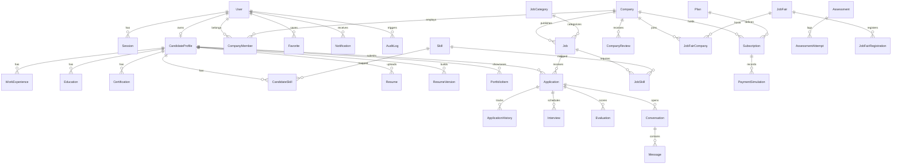

# Diagrama Entidad-Relación (ER) — EmpleaPerú

```mermaid
erDiagram
  User ||--o{ Session : has
  User ||--o| CandidateProfile : owns
  User ||--o{ CompanyMember : belongs
  User ||--o{ Favorite : saves
  User ||--o{ Notification : receives
  User ||--o{ AuditLog : triggers

  CandidateProfile ||--o{ WorkExperience : has
  CandidateProfile ||--o{ Education : has
  CandidateProfile ||--o{ Certification : has
  CandidateProfile ||--o{ CandidateSkill : has
  CandidateProfile ||--o{ Resume : uploads
  CandidateProfile ||--o{ ResumeVersion : builds
  CandidateProfile ||--o{ PortfolioItem : showcases
  CandidateProfile ||--o{ Application : submits

  Company ||--o{ CompanyMember : employs
  Company ||--o{ Job : publishes
  Company ||--o{ Subscription : holds
  Company ||--o{ CompanyReview : receives
  Company ||--o{ JobFairCompany : joins

  JobCategory ||--o{ Job : categorizes
  Job ||--o{ JobSkill : requires
  Job ||--o{ Application : receives
  Skill ||--o{ CandidateSkill : mapped
  Skill ||--o{ JobSkill : mapped

  Application ||--o{ ApplicationHistory : tracks
  Application ||--o{ Interview : schedules
  Application ||--o{ Evaluation : scores
  Application ||--o{ Conversation : opens
  Conversation ||--o{ Message : contains

  Plan ||--o{ Subscription : defines
  Subscription ||--o{ PaymentSimulation : records

  Assessment ||--o{ AssessmentAttempt : logs
  JobFair ||--o{ JobFairCompany : hosts
  JobFair ||--o{ JobFairRegistration : registers
```
